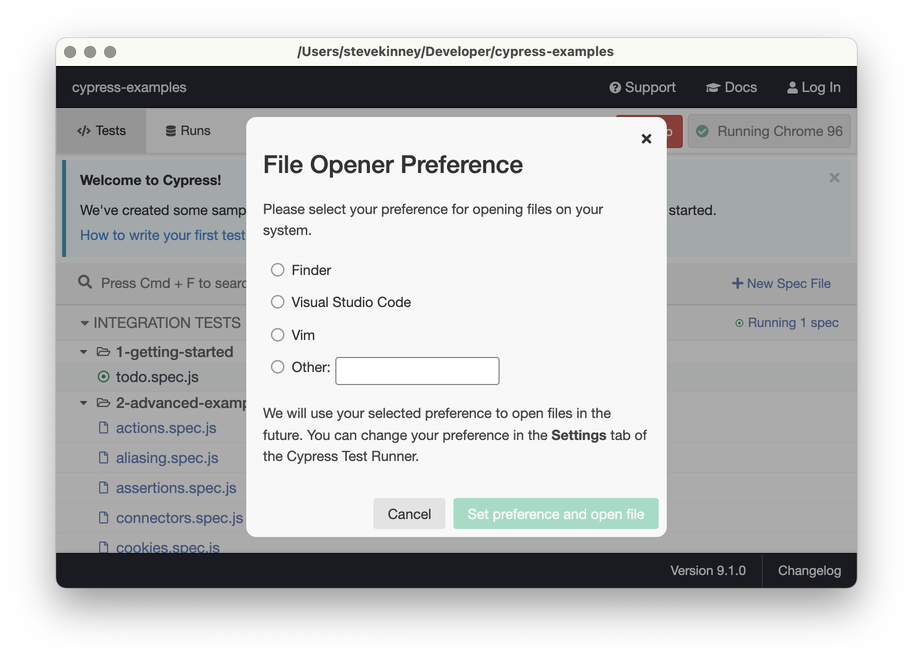
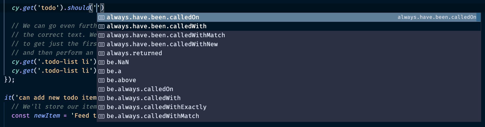

# Anatomy of a Test

**Note**: We're working with [this repository](https://github.com/stevekinney/cypress-starter).

Let's take a look at that test we ran. Click on _Show in IDE_. If this is your first time, you'll see a little modal pop up asking what IDE you'd like. We can argue later is Finder counts an IDE, but I'm going to pick Visual Studio Code



If you've written unit tests before, a lot of this should look familiar. In fact, if you've used [Mocha](https://mochajs.org/) and/or [Chai](https://www.chaijs.com/) before than it _is_ familiar, because that's what Cypress is using under the hood.

You've got your `describe` and `it` blocks. These don't do anything outside of help you organize your tests and letting Mocha know that these are some tests that you want to run.

`beforeEach` runs before each test in this `describe` block. In this case, we're using `cy.visit('https://example.cypress.io/todo')` to visit the page we just saw.

## Finding DOM Nodes

We saw this earlier when we played with the selector playground.

```
cy.get('.todo-list li')
```

`cy.get` basically behavies like `document.querySelector` or the venerable `$` in jQuery. In fact, it _is_ jQuery. Cypress bundles jQuery for its selector engine, but there is one important distinction.

- If jQuery can't find an element on a page, it returns an empty collection.
- If Cypress can't find an element on a page, it will keep trying until it either finds it or an agreed-upon timeout has expired.

Why is this important? Sometimes the content on our page is not immediately there. In these crazy times that we live in, we often send a user a blank page that loads a JavaScript application which, in turn, loads the user interface. There might even be some external APIs we need to hit or resources we need to load along the way.

This is all to say, that we don't want our tests to flake out just because things might take a second. This is why Cypress is will pause for a moment and keep trying before moving forward.

## A Word on Asynchrony

You might be wondering, well my code looks synchronous? It's not. Cypress runs all of your directions asynchronously—allowing it to retry and whatnot, but it saves us from having to use `await` before every line because we're calling methods on the `cy` object, which is basically queuing our commands and running them in order.

The reason I mention this is because this is all well and good as long as you stick to Cypress's conventions. The moment you go rouge and start putting stuff in variables and try to get all clever, you're likely to run into some weird edge cases.

We can talk more about this as we go along, but I'm just placing this in your brain as a little mental bookmark now. You can thank me later.

## Traversing the DOM

There are two major ways in which we can find elements on the page:

- `cy.get`
- `cy.contains`

### `cy.get`

Dust off your jQuery skills, because once you find the element you're looking for, you can traverse up, down, and across the branchs of the DOM's tree.

```js
it('displays two todo items by default', () => {
  cy.get('.todo-list li').should('have.length', 2);

  cy.get('.todo-list li').first().should('have.text', 'Pay electric bill');

  cy.get('.todo-list li').last().should('have.text', 'Walk the dog');
});
```

Here, you'll notice that we're expressing some expectatios about the list, but we're also able to jump to the first and last item of that list using jQuery's chaining.

In the second test, you'll see we even combine the chains.

```js
cy.get('.todo-list li').should('have.length', 3).last().should('have.text', newItem);
```

Once you have a DOM node in your hands, you might want to search in context of that particular DOM node. In this case, you can use `.find()`, which basically words the same a `cy.get()`, but it assumes you're chaning.

```js
cy.contains('Pay electric bill').parent().find('input[type=checkbox]').check();
```

### `cy.contains`

`cy.contains` will try to locate the first DOM node that contains any portion of the text that you specify.

```js
cy.contains('Pay electric bill').parent().find('input[type=checkbox]').check();
```

This can be a little problematic because you don't necessarily want your tests to fail just because someone changed the copy in your application, but you can use it in the following scenarios.

- When you are confident that the text isn't going to change.
- When you put the text in there yourself as part of your test.

## Making assertions

At this point, you might be a bit worried about those strings in your `should()` methods. What happens if you make a typo?

Up at the top of the file, you'll see the following.

```js
/// <reference types="cypress" />
```

This pulls in Cypress's type definitions—regardless of whether or not you're using TypeScript. If you have an editor that supports these type definitions, then autocomplete is your friend.



Curious about what assertions you can use? Cypress bundles Chai, Sinon, and jQuery-Chai. You can see [a list of available assertions here](https://docs.cypress.io/guides/references/assertions).

You can also chain your assertions.

```js
cy.get('.assertions-link')
  .should('have.class', 'active')
  .and('have.attr', 'href')
  .and('include', 'cypress.io');
```

## Conclusion

There are a bunch more things that we can do. For example, we'll probably want to type in various input fields and click on things. These are all very reasonable things to want to do. But, let's stop talking about Cypress and start actually writing some tests.
