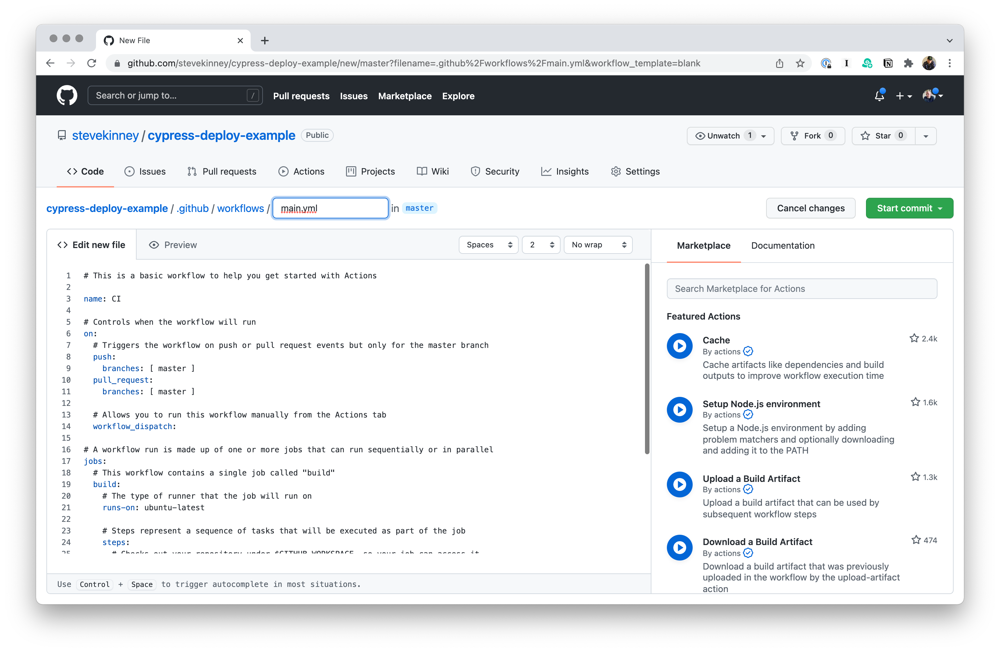
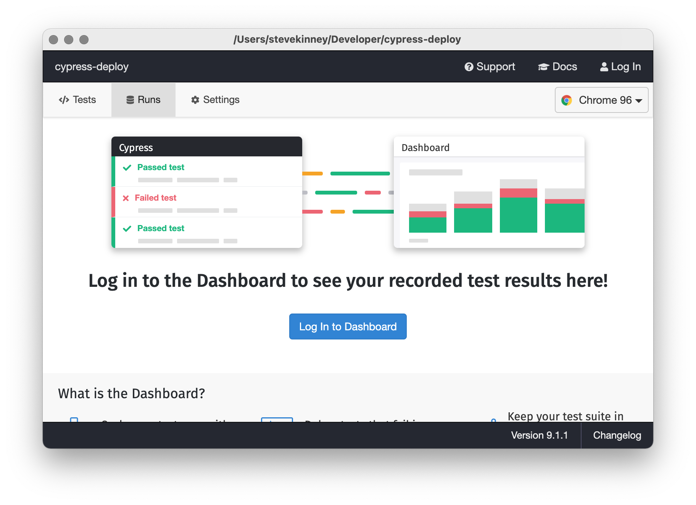
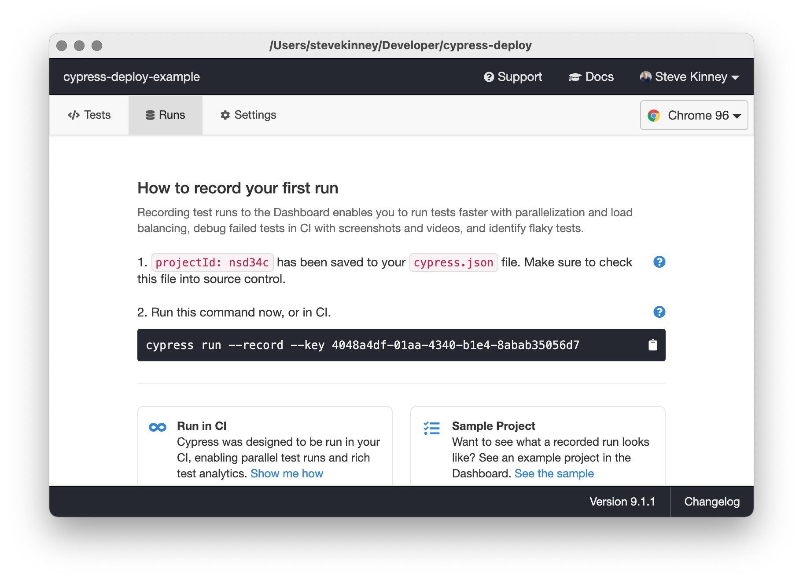
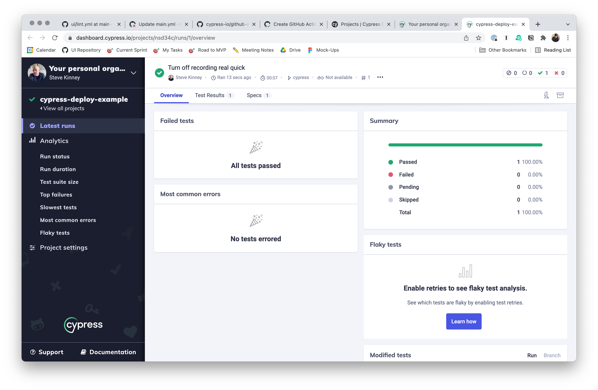
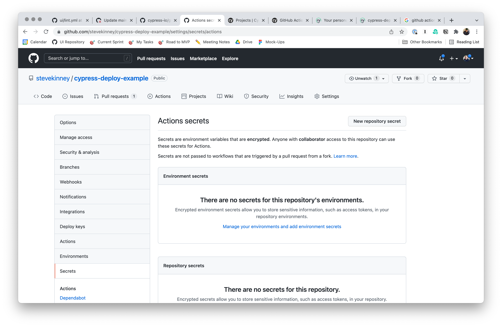
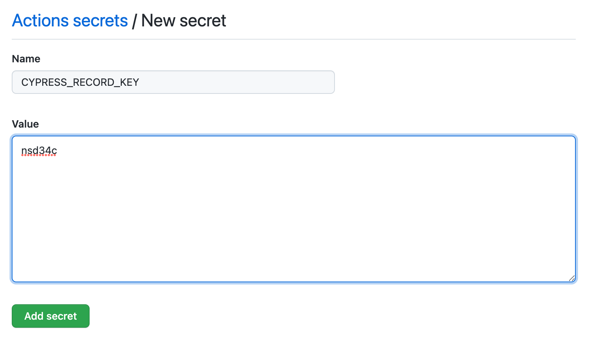
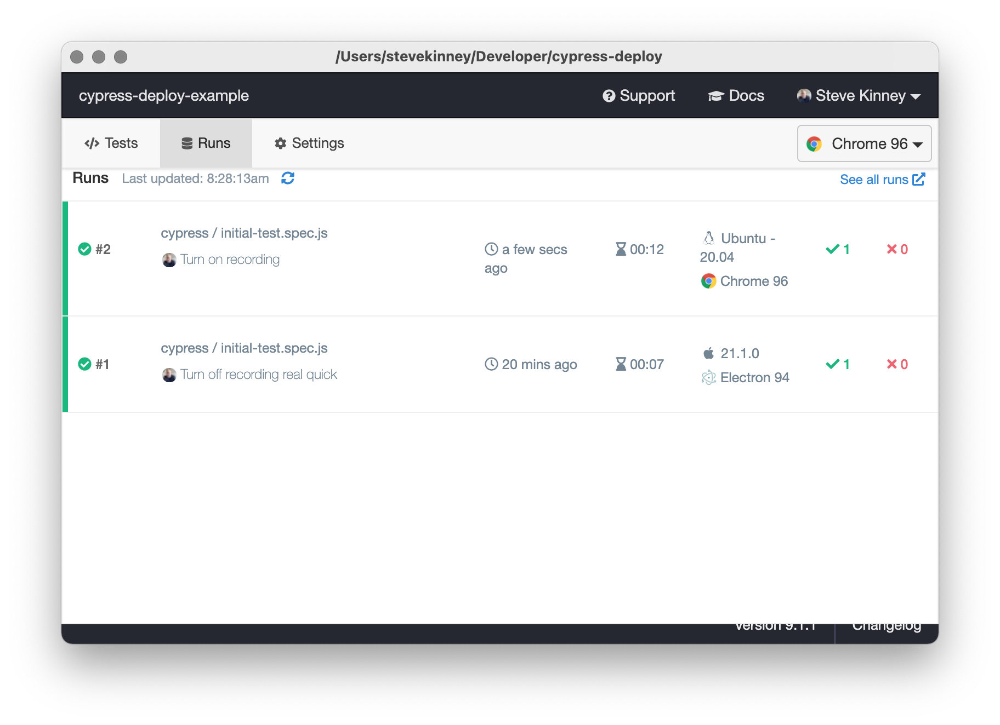
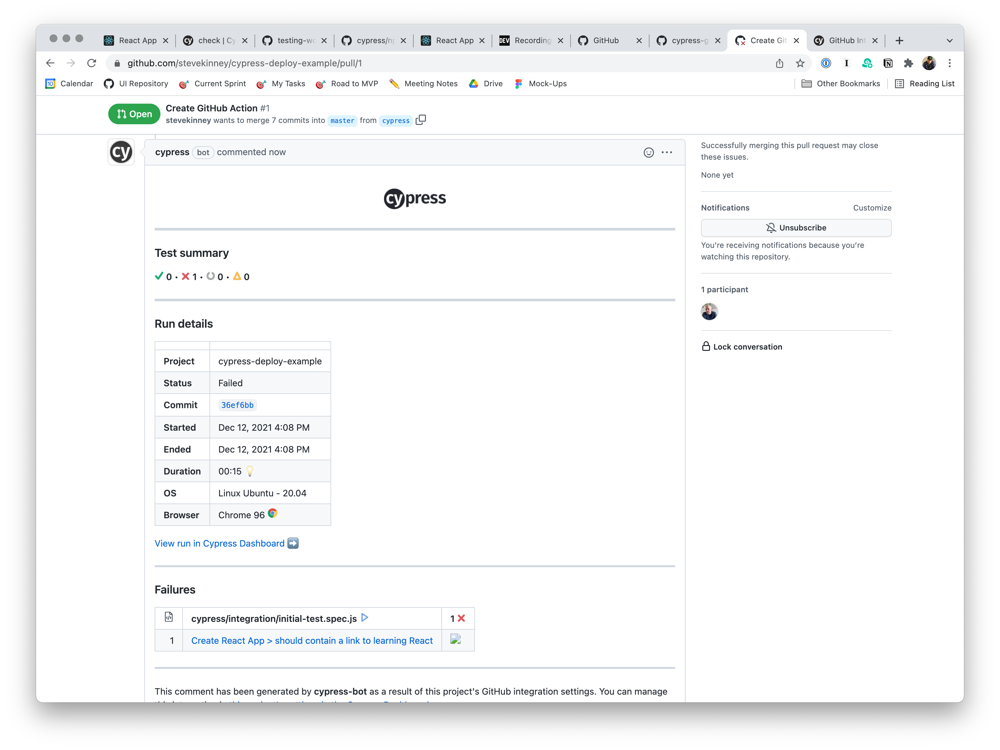

# Continuous Integration with GitHub Actions

## Running Cypress in Headless Mode

What if you want to run Cypress in CI/CD?

```sh
npx cypress run
```

This will _not_ run the Desktop application, but it _will_ record video for you to review if anything fails.

## Setting Up a Github Action



You can search the Marketplace on the side, but it basically just gives you some boilerplate to copy-paste.

The good news is that [GitHub Actions already support running Cypress tests](https://github.com/cypress-io/github-action). All we have to do is configure it.

```yml
name: Run Cypress Tests
on: [push]
jobs:
  cypress-run:
    runs-on: ubuntu-latest
    steps:
      - name: Checkout
        uses: actions/checkout@v2
      - name: Install modules
        run: npm ci
      - name: Cypress
        uses: cypress-io/github-action@v2
        with:
          browser: chrome
          headless: true
          start: npm start
          wait-on: http://localhost:3000
```

So, what's going on here?

- Checkout the most recent commit.
- Install your dependencies via `npm`.
- Run the Cypress tests _after_ the server starts up.

## Cypress Dashboard

The Cypress Dashboad is super helpful. It's free for open source projects. One of its most compelling use cases is to make it easy to evaluating recordings of your test runs—particularly in CI/CD.



Once you log in, Cypress will save a `projectId` to your `cypress.json`.



I can run it from my local machine, but that's kind of silly.



What we _really_ want to do is have these results generate from our build pipeline.

### Connecting GitHub Actions to Cypress Dashboard

We're going to want to store that `projectId` into GitHub Actions so that we can reference it from our workflows.



We'll create a new secret called `CYPRESS_RECORD_KEY`.



And now, we'll update our `main.yml` as follows:

```yml
name: Run Cypress Tests
on: [push]
jobs:
  cypress-run:
    runs-on: ubuntu-latest
    steps:
      - name: Checkout
        uses: actions/checkout@v2
      - name: Install modules
        run: npm ci
      - name: Cypress
        uses: cypress-io/github-action@v2
        with:
          browser: chrome
          headless: true
          record: true
          start: npm start
          wait-on: http://localhost:3000
        env:
          CYPRESS_RECORD_KEY: ${{ secrets.CYPRESS_RECORD_KEY }}
```

We're adding `record: true` to the Cypress action itself as well as setting the environment variable from our repositories secrets.



## Adding GitHub support

We've wired up GitHub actions to talk to Cypress, but what if we did the reverse?


We'll need to give Cypress our GitHub token in order to do this.

We'll add `GITHUB_TOKEN: ${{ secrets.GITHUB_TOKEN }}` to the `env` section in our `main.yml`.

Now, make the test intentionally fail. Cypress will comment on the PR with a run down of what happened.


