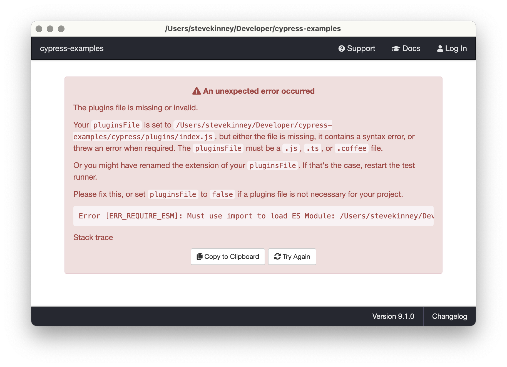
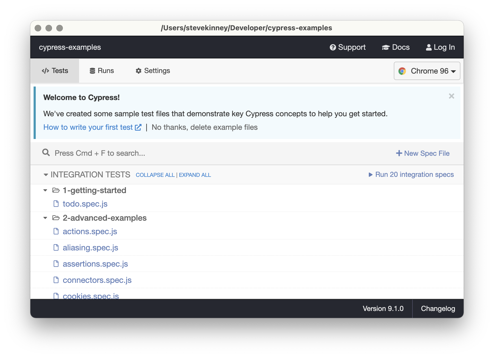
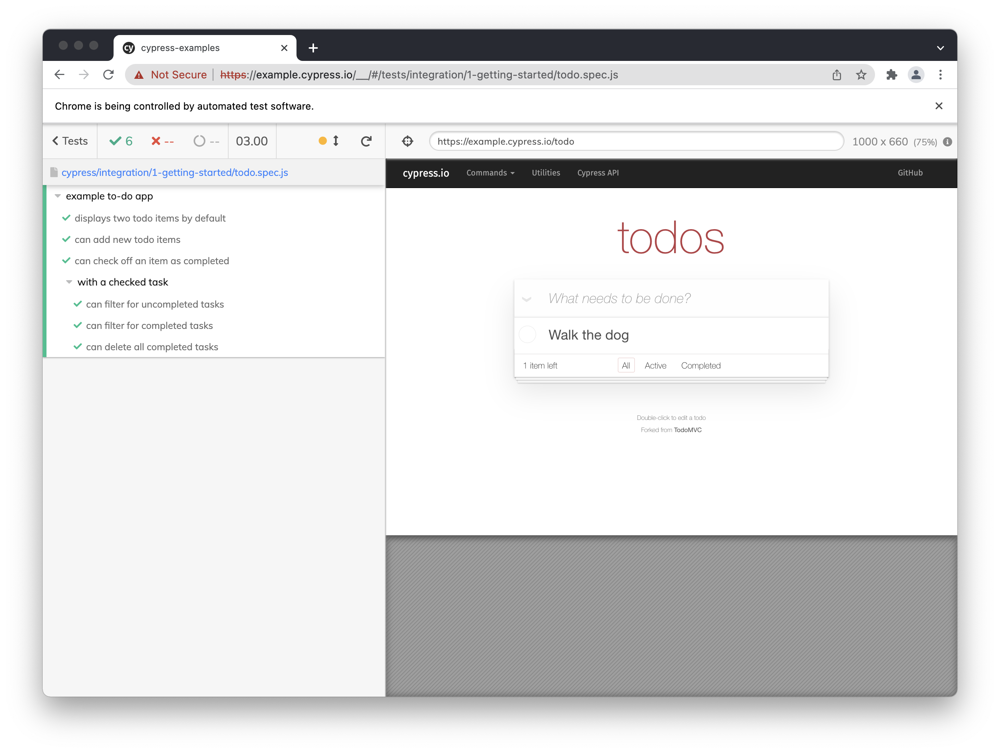
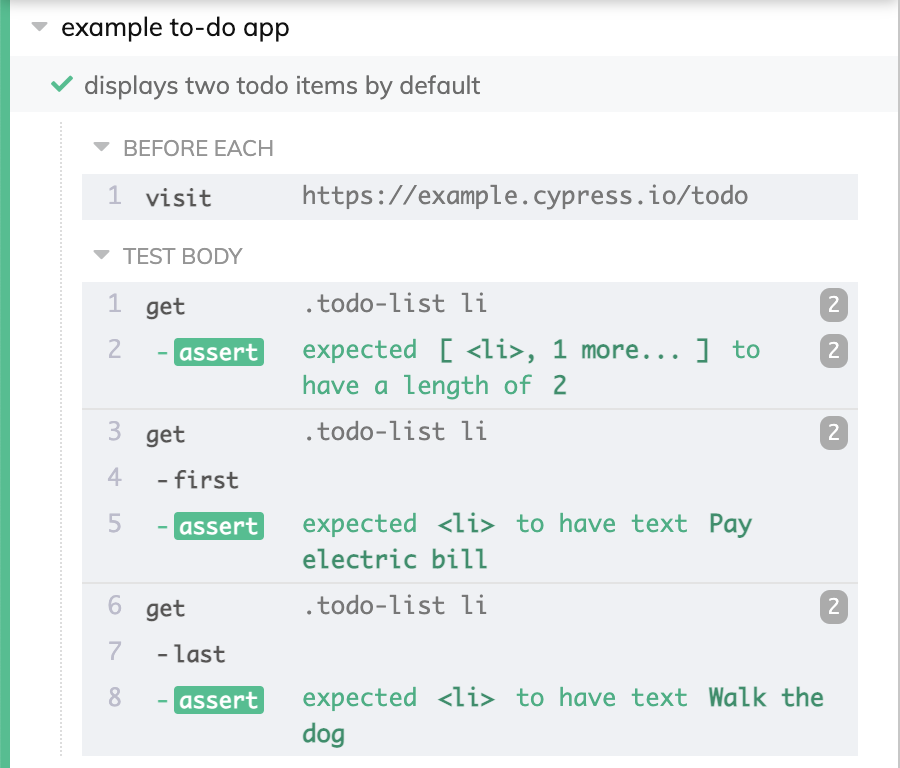
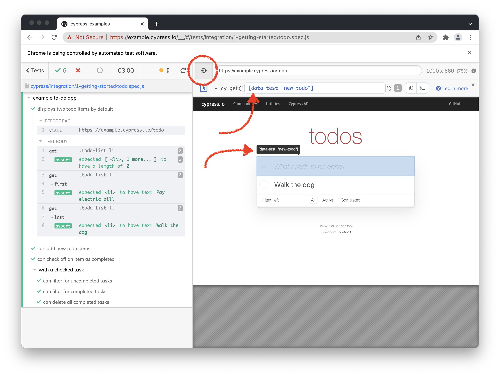

# Getting Started

## Installing Cypress

It's not unreasonable to think that maybe we should install Cypress before we try to use it. Luckily, this is a relatively simple endeavor.

There are a few ways that we can go about this, but I'm going to recommend installing it via `npm`.

```
npm install cypress --save-dev
```

Why? Well, there are a few reasons:

- You probably already have `npm`, so there is that.
- By default, you're have a version of Cypress pinned to this particular project. If you globablly install Cypress using any of the other options, then please accept my best wishes two years from nowwhen you return to work on an older project.
- It makes your life easier when you want to integrate Cypress into your CI/CD pipeline—and you're going to want to integrate Cypress into your CI/CD pipeline.

## Setting up Cypress

We're not totally done yet. We need to get Cypress set up before we're ready rock-and/or-roll. Luckily, that's fairly straightforward as well.

```
npx cypress open
```

### A word on ECMAScript modules



If you're using ECMAScript Modules (ESM) or TypeScript, you'll be greeted immediately with an unfriendly error about your plugins file. Depending on your situation, there are a few ways that you can go about addressing this.

There is an [open issue](https://github.com/cypress-io/cypress/issues/16467) around this.

- If you're using TypeScript, rename `cypress/plugins/index.js` to `cypress/plugins/index.ts`.
- Don't use `{ "type": "module" }` in your `package.json`.
- Nuclear option: If you need to use ESM, but you also need to not have TypeScript anywhere in your project, you could keep your Cypress tests in their own repository. There are, of course, some caveats to this:
  - It'll be harder if you want to import files from your code base.
  - Setting up build pipelines will likely be more complicated.

My suggestion: This file can be TypeScript even if the rest of your project isn't since it's relatively isolated. While my sample applications are written in TypeScript, I'll choose to _not_ really use TypeScript with Cypress to demonstrate this.

With that, you should be up and running.



**Nota bene**: One thing that I learned when preparing for this course is that if you don't change the file extension in the beginning, then you'll be in for a sad time. (I learned this by repeatedly changing it back and forth while working on this content, so that's probably not a common use-case. But I figured I'd mention it.)

## File structure

By simply opening Cypress, it laid some initial groundwork for you.

You'll notice that a lot of that are example files. But, there are three major pieces folders that we're going to work with:

- **Integration**: These are your tests.
- **Fixtures**: This is data that you're going to use in your tests. If you're stubbing out API calls or anything like that, this is where you'll store that test data.
- **Support** : This is where you'll put your _commands_, which are basically just like shortcuts for common functionality.
- **Plugins**: This is where you'll install your—umm—plugins. We'll talk more about this later.

## Running your tests

There is a little link that will allow you to clear out most of the example tests, but before we do that—let's take one for a spin.

Under `1-getting-started`, you'll see we can click on the test. Let's go for it.



There are a few things to notice here:

- It looks like Chrome, but it has a black theme. This is not my theme, it signifies that Chrome is being controlled by Cypress. You'll even see that cute note: "Chrome is being controlled by automated test software." Yup, you're right it is.
- On the left, we have all of the tests that ran.
- On the right, we have an `iframe` with the page we're visiting. In this case, it's [example.cypress.io/todo](https://example.cypress.io/todo).

Clicking on a given test will allow you to see all of the steps Cypress took when executing your test.



You'll also notice a little target icon above the site preview. This allows you to quickly target selectors from the context of your test. Yes, you can do this in the browser, but sometimes it's also nice to be able to do in the context of your test—and with any test data you might have loaded up.



You'll also notice a toolbar that pops up and shows you the selector that you can use in your tests. The toolbar has buttons for copying to your clipboard or logging the selector to the console.

### A word on selectors

We'll talk a little about the syntax in a bit. But, one thing I want you to notice is that the selector playground is going to try its hardest to give you the least insane selector. In the case of the screenshot above, you can see we are using a data attribute instead of an `id` or `class`.

```js
cy.get('[data-test="new-todo"]');
```

The thinking here is that the markup you use for styling your application might change and break your tests. Therefore, it's not great to be tightly bound to class names. Instead, we can use data attributes to identify DOM nodes that we want to target.

This is just a best practice and not forced upon you, but it on the other end of the spectrum, I'm sure you can appreciate how this might break, right?

```js
cy.get(':nth-child(1) > :nth-child(2) > a');
```

Lastly, you'll notice that the selector playground will also tell you how many elements on the page match the selector you just chose. This is super helpful information in the event that you want to make sure your tests are going to get confused.
