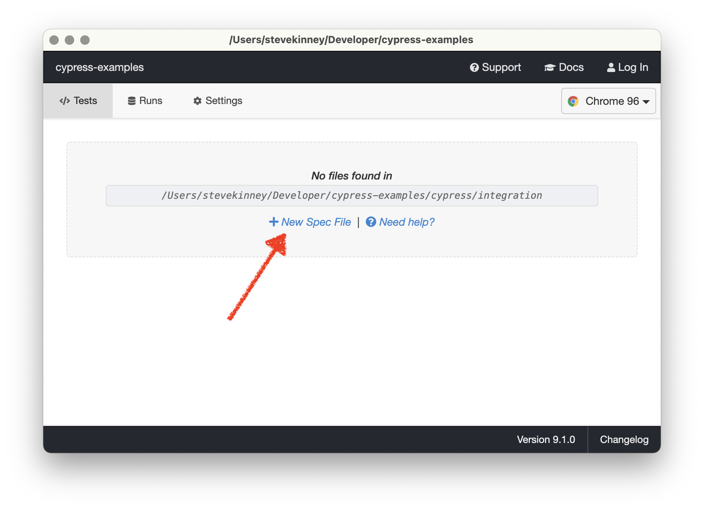

# Writing Tests

As part of this workshop, we have [a repository full of sample applications](https://github.com/stevekinney/cypress-examples) that we can use to get comfortable with testing.

You can see the instructions for getting set up [here](Set%20Up.md).

We're going to start by testing out a little application for keeping track of our packing list before each trip.

We'll start by making a new file for our tests. You can call it whatever you want, but I'm going to call it `01-first-flight.spec.js`.

You can just make it in your editor or you can click that fancy "New Spec File" button.



The one thing I will recommend right away is we add that friendly reference to the type definition.

```html
/// <reference types="cypress" />
```

**Pro-Tip**: If you get tired of copying and pasting this, you can create a snippet in VS Code.

```json
{
  "Add Cypress Reference Types": {
    "scope": "javascript,typescript",
    "prefix": "cyref",
    "body": "/// <reference types=\"cypress\" />",
    "description": "Add a reference to Cypress's type definitions"
  }
}
```

Now, you can just use `cyref` to insert this reference.

### Visiting the correct page

The first thing we're going to want to do is to visit the application, which is hosted at `https://localhost:3000`. And, we're going to want to do this before every test.

```js
beforeEach(() => {
  cy.visit('http://localhost:3000/jetsetter');
});
```

### Making a simple assertion

Let's start small and just verify that there is even a form on the page and then we'll take it from there.

```js
describe('Create a New Item', () => {
  beforeEach(() => {
    cy.visit('http://localhost:3000/jetsetter');
  });

  it('should have a form', () => {
    cy.get('form').should('exist');
  });
});
```

## Understanding when Cypress succeeds or fails

Some testing frameworks like Jest will fail if there are no assertions. This is not the case for Cypress.

Cypress will kick the tires on your application as your dictate and as long as nothing goes wrong, it's going to consider the whole endeavor a resounding success.

For example, we _could_ modify our test as follows.

```js
it('should have a form', () => {
  cy.get('form');
});
```

It found the element and then it was done. So, we're all good and we'll call it a successful test run. But, what if we go looking for an element that doesn't exist?

```js
it('should have a form', () => {
  cy.get('formm');
});
```

> Timed out retrying after 4000ms: Expected to find element: `formm`, but never found it.

In this case it failed. Alternatively, if you wanted to make sure that it actively didn't exist, you could check for the opposite.

```js
it('should not have a formm', () => {
  cy.get('formm').should('not.exist');
});
```

### Failing on Actions That Aren't Available

We can take this a step further. You'll notice that the "Add Item" button is disabled until we type something into the associated input field.

What happens if we try something like this?

```js
it('should have an input button that is clickable', () => {
  cy.get('[data-test="add-item"]').click();
});
```

As you might expect, we'll get an error.

> Timed out retrying after 4050ms: `cy.click()` failed because this element is disabled:
>
> `<button class="block w-1/4" id="add-item" data-test="add-item" disabled="">Add Item</button>`

### Asserting Failure

Now, it's probably more reasonable to just assert that the button is disabled, but this is a decent opportunity to talk about what to do if you _want_ to see a test fail.

```js
it('should fail at clicking a button', (done) => {
  cy.get('[data-test="add-item"]').click();

  cy.once('fail', (error) => {
    expect(error.message).to.include('this element is `disabled`');

    done();
  });
});
```

The important thing to point out is that if a test is asynchronous, then you need to pass in `done` as an argument to the test function and call it when you're all done. The other thing to notice is that we're putting a one-time event listener for Cypress failures using `cy.once('fail')`.

But, like I said—this is a much more reasonable test:

```js
it('should have an "Add Item" button that is disabled', () => {
  cy.get('[data-test="add-item"]').should('be.disabled');
});
```

## Interacting with the DOM: Typing

We just saw that we can call `.click()` on a DOM node to simulate a click event, but what if we wanted to type into the input field? You get one guess.

```js
it('should enable "Add Item" when text is in the input field', () => {
  cy.get('[data-test="new-item-input"]').type('Good Attitude');
  cy.get('[data-test="add-item"]').should('be.enabled');
});
```

Alternatively, now `.click()` will successfully execute.

```js
it('should enable "Add Item" when text is in the input field', () => {
  cy.get('[data-test="new-item-input"]').type('Good Attitude');
  // cy.get('[data-test="add-item"]').should('be.enabled');
  cy.get('[data-test="add-item"]').click();
});
```

I still prefer the former, but you're your own person and you can make your own choices.

## Conclusion

As this point, this is what we're working with.

```js
describe('Create a New Item', () => {
  beforeEach(() => {
    cy.visit('http://localhost:3000/jetsetter');
  });

  it('should have a form', () => {
    cy.get('form').should('exist');
  });

  it('should have an "Add Item" button that is disabled', () => {
    cy.get('[data-test="add-item"]').should('be.disabled');
  });

  it('should enable "Add Item" when text is in the input field', () => {
    cy.get('[data-test="new-item-input"]').type('Good Attitude');
    // cy.get('[data-test="add-item"]').should('be.enabled');
    cy.get('[data-test="add-item"]').click();
  });
});
```
